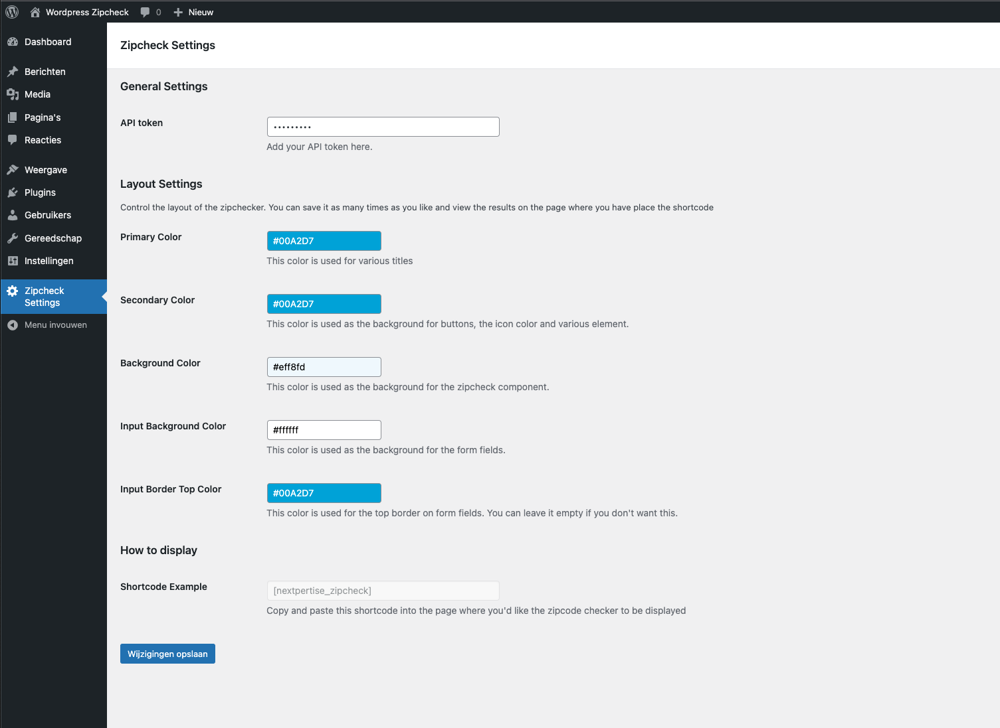

# Nextpertise Wordpess Zipcheck Plugin
The Nextpertise Wordpress Zipcheck plug-in is a plug-in that allows you to embed [Nextpertise's zipchecker](https://nextpertise.nl/postcode-check/) in your website, without coding.

## Installation
You can download a [ZIP version of the plugin here](https://github.com/Nextpertise/wordpress-zipcode-check-plugin/archive/refs/heads/master.zip). This ZIP can be uploaded to your WordPress installation (WP Admin -> Plugins -> Add New -> Upload Plugin). After installing the plugin, don't forget to enable it on the plugins page!

## Configuration
You'll have a couple of options to configure the zipcheck plugin. You'll find them in WordPress under Zipcheck Settings.
1) Configure your API token under (WP Admin -> Zipcheck Settings). 
2) In the same section, you can configure your brand colors to make the zipchecker blend into your website. Explore the different options and see what fit's your requirements best.
3) Simply paste the following shortcode `[nextpertise_zipcheck]` on the page where you want to display the zipcheck.

# Upgrading from the old plugin
If you're upgrading from the old plug-in, there are two notable changes for you to take into account.
1) The authentication method has changed, previously you would authenticate using your username and password. Your password **is not** the same as your token. Please do not enter your password as an api token, **it will be exposed**. You should request a new token from Nextpertise.
2) Previously you'd have to create your own address form. The new plug-in takes care of this for you. If you've had the form on the same page, please remove the old address form. If it's on a different page, you might as well leave it there as url-parameters will still work on the new plug-in

# Development notes
If you'd like to load the source for the zipcode from any other destination then the CDN, you can set define a constant named `ZIPCHECK_JS_URI`. This is usefull for instance when you develop locally, or want tot temporarily bypass the CDN cache. Put the following line in your `wp-config.php`
`define('ZIPCHECK_JS_URI', 'https://raw.githubusercontent.com/Nextpertise/js-zipcode-check-plugin/main/dist/js/app.js');`
